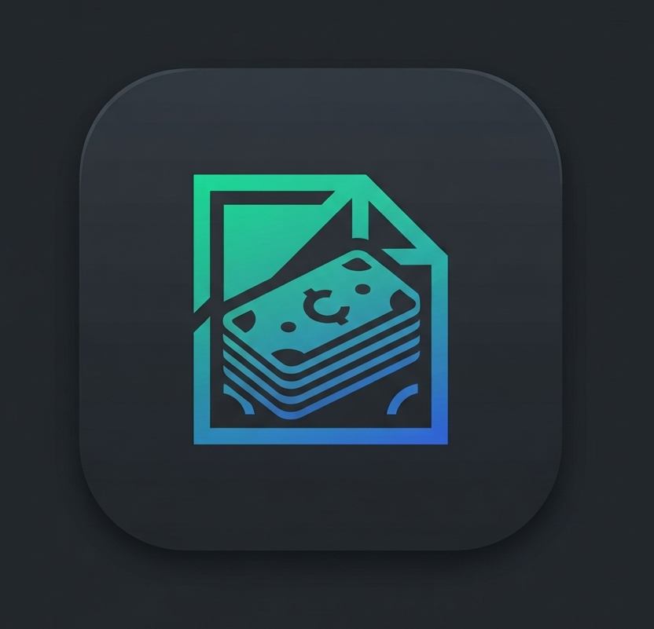

<p align="center">
  
</p>

<h1 align="center">BirrNote</h1>

<p align="center">
  <strong>AI-powered personal finance for Ethiopia</strong><br/>
  Track expenses in plain Amharic, Oromiffa, or Tigrinya the AI figures out the rest.
</p>

<p align="center">
  
  
  
  
</p>

---

## What it does

BirrNote is a personal finance app built specifically for Ethiopians. Instead of tapping through forms, you type what you spent in natural language in any of the supported languages and Gemini AI parses it into structured, categorized expenses automatically.

**The core idea:** Tracking money should be as easy as sending a text message.

---

## Key Features

| Feature | Details |
|---|---|
| 🤖 **AI Note Parsing** | Type `"ቁርስ 80 ትራንስፖርት 30"` → AI extracts two expenses, categorizes each, done. Powered by Gemini 3.1 Flash Lite with structured JSON output. |
| 📊 **Visual Analytics** | Interactive pie charts (category breakdown) and bar charts (spending trends) via `fl_chart`. Filter by week, month, quarter, or all time. |
| 💰 **Smart Budget Engine** | Set daily/weekly/monthly/quarterly/yearly budgets. Calculates a rolling "Today's Spending Power" how much you can still spend today without going over. Supports rollover math across Ethiopian calendar cycles. |
| 🗓️ **Ethiopian Calendar** | Full Ethiopian calendar support via `abushakir`. Budget cycles, date pickers, and history all work natively in both Gregorian and Ethiopian modes. |
| 🌍 **Multilingual** | Full UI translations for **Amharic**, **Oromiffa**, **Tigrinya**, and **English** 370+ translation keys. |
| ☁️ **Serverless Cloud Backup** | Silent backup/restore to the user's own Google Drive `appDataFolder`. Zero infrastructure cost. No Firebase. Uses `google_sign_in` v7 + `googleapis` Drive API. |
| 🔔 **Daily Reminders** | Scheduled push notifications with timezone-aware scheduling (handles `Africa/Addis_Ababa` gracefully). |
| 💬 **AI Financial Advisor** | Chat with Gemini about your spending. It reads your last 90 days of transactions and your active budget, then gives contextual advice. |
| 🎨 **Theming** | Light/dark/system theme modes with a custom Material 3 design system. |

---

## Architecture

```
lib/
├── core/
│   ├── database/        # Drift ORM SQLite with typed DAOs, migrations, seeded categories
│   ├── network/         # Gemini AI service (parsing + advisor), API key management
│   ├── notifications/   # Timezone-safe daily reminders (exact + inexact fallback)
│   ├── theme/           # Material 3 light/dark theme definitions
│   └── utils/           # Translations (4 languages), calendar type, locale providers
│
├── features/
│   ├── expense_entry/   # AI parsing pipeline, budget engine, offline queue processor
│   ├── dashboard/       # Charts, spending trends, analytics
│   ├── ai_advisor/      # Financial chat with 90-day ledger context
│   ├── settings/        # Google Drive sync, categories, reminders, API key, language
│   └── navigation/      # Bottom nav shell
│
└── main.dart            # Bootstrap: notifications, shared prefs, Riverpod overrides
```

**State Management:** Riverpod (providers, streams, state notifiers)
**Database:** Drift (SQLite) with code-generated DAOs and schema migrations
**AI:** Google Generative AI SDK with structured JSON output schemas
**Cloud:** Google Sign-In v7 → googleapis Drive v3 (no Firebase dependency)

---

## Built With

| Layer | Technology |
|---|---|
| Framework | Flutter 3.11+ / Dart 3.11+ |
| State | Riverpod 3 |
| Database | Drift 2.33 (SQLite) |
| AI | Google Generative AI (Gemini 3.1 Flash Lite) |
| Charts | fl_chart |
| Cloud Sync | Google Sign-In v7 + googleapis Drive v3 |
| Calendar | abushakir (Ethiopian) + ethiopian_datetime_picker |
| Notifications | flutter_local_notifications + timezone |
| Security | flutter_secure_storage (API key encryption) |

---

## Screenshots

<!-- 
  Add 3-5 screenshots here. Example format:
  <p align="center">
    
    
    
  </p>
-->

> 📸 *Screenshots coming soon see the [demo video](https://youtube.com/shorts/lG8cJFQA8Rc?si=7YuRcPw4FN8rmCYq) below for a full walkthrough.*

---

## Demo

<!-- Replace with your actual Loom / YouTube link -->
> 🎬 **[Watch the demo →](https://youtube.com/shorts/lG8cJFQA8Rc?si=7YuRcPw4FN8rmCYq)**

---

## Setup

1. **Clone the repo**
   ```bash
   git clone https://github.com/PhiliposHailu/BirrNote.git
   
   cd birr_note
   ```

2. **Install dependencies**
   ```bash
   flutter pub get
   ```

3. **Generate database code**
   ```bash
   dart run build_runner build --delete-conflicting-outputs
   ```

4. **Run**
   ```bash
   flutter run
   ```

5. **Get a Gemini API key** The app prompts you to enter your own key in Settings. Get one free at [aistudio.google.com](https://aistudio.google.com/).

---

## Why I built this
To be Honest I built it because i found every expense tracker on the Play Store to be too complex and not made to fit for our local community, it assumes you live in the US, use the Gregorian calendar, and speak English. None of them handle the Ethiopian calendar. None of them let you type expenses in Amharic. I built the app I actually needed and use on a daily basis.

---

<p align="center">
  Built by <a href="https://github.com/PhiliposHailu">Philipos Hailu</a>
</p>

